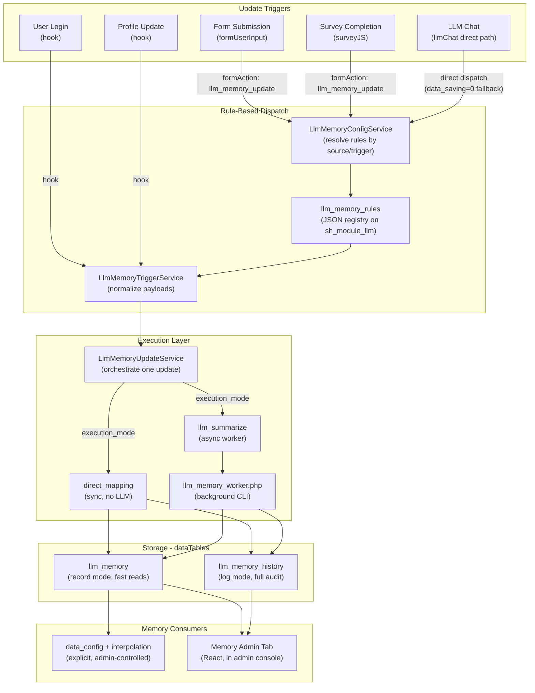

# LLM User Memory System

Based on the detailed design document at [global_memory.md](global_memory.md).

## Concept

Global per-user memory as a **module-level capability** of `sh_module_llm`, not a property of any one chat style. Memory is one per user, updated by reusable rules triggered from forms, surveys, chats, login, and profile changes. Memory is consumed only through explicit `data_config` interpolation -- no hidden injection.

## Architecture



## Key Design Decisions (from [global_memory.md](global_memory.md))

1. **Module-level, not style-level**: Memory config lives on `sh_module_llm` page, not per llmChat. Multiple chats share one global memory.
2. **Explicit consumption via `data_config` only**: No hidden memory injection into LLM context. Admins load memory fields into prompts through standard `data_config` interpolation in the `conversation_context` field (e.g., `current user memory: {{memory_text}}`). This keeps usage visible, controllable, consistent.
3. **Two tables -- current + history**: `llm_memory` (record mode, one row per user) for fast reads/interpolation. `llm_memory_history` (log mode, append-only) for full audit. Default storage mode is `both`.
4. **Reusable rule registry**: `llm_memory_rules` JSON field on the module config page. Each rule defines source matching, trigger types, prompt template, execution mode, model overrides. Rules are referenced by key from form actions and direct bindings.
5. **Async all LLM calls**: `llm_summarize` execution mode always spawns `llm_memory_worker.php` in background. Source actions (form submit, chat, login) never wait for LLM.
6. **`direct_mapping` for lightweight updates**: Login, profile changes, and simple form fields use synchronous direct writes -- no LLM call needed.

## Storage Design

### Two Tables (dataTables-backed)

**`llm_memory`** (record mode -- current effective state):
- `id_users`, `memory_key`, `memory_text`, `memory_json`, `memory_version`
- `last_rule_key`, `last_source_type`, `last_source_ref`, `last_trigger_type`
- `last_payload_json`, `last_updated_at`
- Dynamic flattened columns from `flat_fields`

**`llm_memory_history`** (log mode -- every update event):
- `id_users`, `memory_key`, `memory_text`, `memory_json`, `prev_memory_json`
- `rule_key`, `source_type`, `source_ref`, `trigger_type`, `payload_json`
- `change_summary`, `worker_status`, `created_at`
- Dynamic flattened columns from `flat_fields`

### Storage Modes (configurable via lookup)
- `record`: write only to current table
- `log`: append only to history table
- `both` (default): update current + append history

### Worker Output Contract

The LLM must return strict JSON:
```json
{
  "memory_text": "user prefers short motivational guidance...",
  "memory_object": { "preferred_tone": "short_motivational", "main_goal": "sleep regularity" },
  "flat_fields": { "preferred_tone": "short_motivational", "main_goal": "sleep regularity" },
  "change_summary": "updated main goal from stress reduction to sleep regularity."
}
```
`flat_fields` are written as normal columns in the dataTable for direct `data_config` access.

## Module-Level Configuration (`sh_module_llm`)

Fields added to the global LLM config page (all prefixed `llm_` for `getLlmConfig()` compatibility):

- `llm_memory_enabled` (checkbox) -- master switch
- `llm_memory_key` (text, default `global`) -- memory namespace
- `llm_memory_storage_mode` (select via lookup, default `both`) -- `record`/`log`/`both`
- `llm_memory_table_name` (text, default `llm_memory`)
- `llm_memory_history_table_name` (text, default `llm_memory_history`)
- `llm_memory_rules` (json-llm-memory-rules custom field) -- the central rule registry
- `llm_memory_admin_enabled` (checkbox) -- enable admin tab

## Rule Registry

`llm_memory_rules` is a JSON array on the module config page. Each rule:

```json
{
  "key": "sleep_form_finished",
  "label": "Sleep Form Finished",
  "enabled": true,
  "memory_key": "global",
  "source_type": "form_action_submit",
  "source_match": { "table_name": "0000001234" },
  "trigger_types": ["finished"],
  "execution_mode": "llm_summarize",
  "storage_mode_override": null,
  "data_config": [...],
  "prompt_template": "...",
  "llm_model": "",
  "llm_temperature": 0.2,
  "llm_max_tokens": 1200,
  "refresh_sections": []
}
```

Supported `source_type` values for v1:
- `form_action_submit` -- canonical for all forms/surveys via `UserInput::save_data()`
- `llm_chat_form_submit` -- fallback when llmChat data saving is disabled
- `login` -- hook on `Login::update_timestamp()`
- `profile_name_change` -- hook on `ProfileModel::change_user_name()`

Supported `execution_mode`:
- `direct_mapping` -- sync, field-to-field write, no LLM
- `llm_summarize` -- async background worker with LLM call

## Per-Style Config (`llmChat`)

Minimal -- only controls participation, not memory identity:

- `memory_rule_keys` (text, comma-separated) -- which rules to dispatch directly when `enable_data_saving=0`. When data saving is on, form actions handle it instead.

No `enable_memory` injection toggle. Memory enters the prompt **only** through `data_config` interpolation in `conversation_context`.

## Service Architecture (5 services)

### `LlmMemoryConfigService`
- Load module memory fields from `getLlmConfig()`
- Parse `llm_memory_rules` JSON
- Resolve rules by key, by source_type + source_match + trigger_type
- Apply defaults (storage mode, model, etc.)

### `LlmMemoryStorageService`
- Initialize current + history dataTables (auto-create on first use via `UserInput`)
- `saveCurrentMemory($user_id, $data)` -- record mode write
- `appendHistory($user_id, $data)` -- log mode append
- `getEffectiveMemory($user_id)` -- load current row
- `clearMemory($user_id)`
- Flatten `flat_fields` into proper columns

### `LlmMemoryTriggerService`
- `normalizeFormActionPayload($form_data)` -- from `queue_job_from_actions()`
- `normalizeLlmChatPayload($conversation_id, $message, $form_values)`
- `normalizeLoginPayload($user_id)`
- `normalizeProfilePayload($user_id, $old_name, $new_name)`

### `LlmMemoryUpdateService`
- Orchestrate a single memory update:
  1. Resolve rule via config service
  2. Normalize payload via trigger service
  3. Load current effective memory
  4. If `direct_mapping`: resolve field mapping, write via storage service
  5. If `llm_summarize`: build interpolation vars, interpolate prompt, spawn async worker
  6. Validate worker output against required schema
  7. Persist via storage service (respecting storage mode)
  8. Write refresh events if configured

### `LlmMemoryAdminService`
- `getMemoryList($filters, $pagination)` -- all users with current memory summary
- `getUserMemoryDetail($user_id)` -- full current state
- `getUserMemoryHistory($user_id, $pagination)` -- timeline of updates
- `rebuildMemory($user_id)` -- re-derive current from history
- `manualEdit($user_id, $data)` -- admin override

## Async Worker: `llm_memory_worker.php`

Same pattern as existing [server/service/llm_async_worker.php](server/service/llm_async_worker.php):

1. CLI-only, reads args from temp JSON file
2. Bootstraps SelfHelp services
3. Resolves rule, loads current memory
4. Resolves `data_config` if rule has one
5. Builds interpolation variables (memory vars + event vars + data_config vars)
6. Interpolates `prompt_template`
7. Calls LLM API (synchronous within worker, but worker itself runs in background)
8. Validates output (`memory_text`, `memory_object`, `flat_fields`, `change_summary` required)
9. On validation failure: logs error, does NOT overwrite effective memory
10. On success: persists via storage service, writes refresh events, logs transaction

Spawn uses `LlmHooks::find_php_cli_binary()` + `popen()`.

## Trigger Integration

### Form Actions (canonical path for forms/surveys)
- Admin adds `formAction` on any dataTable with `job_type = llm_memory_update`
- Job config references a `memory_rule_key`
- `LlmHooks::execute_llm_memory_task()` processes the job
- Reuses existing hook pattern from `llm_script` (extends `get_json_schema`, `get_task_config`, `get_job_type`)

### llmChat Direct Path (fallback when data_saving=0)
- `LlmChatController::handleFormSubmission()` checks `memory_rule_keys`
- Dispatches to `LlmMemoryUpdateService` directly
- When `enable_data_saving=1`, form actions handle it instead

### Login Hook
- `hook_on_function_execute` on `Login::update_timestamp()`
- After original method succeeds, enqueues matching memory rules asynchronously
- Payload: `{ user_id, last_login, user_name }`

### Profile Hook
- `hook_on_function_execute` on `ProfileModel::change_user_name()`
- After original method succeeds, enqueues matching memory rules
- Payload: `{ user_id, old_name, new_name }`

## Admin UI

New "Memory" tab in existing `moduleLlmAdminConsole` (React):

- **User list**: user name/email, memory key, summary preview, last updated, last rule, storage mode
- **Detail panel**: full `memory_text`, pretty-printed `memory_json`, flattened fields, source metadata
- **Timeline/history**: chronological updates with rule key, source type, change summary, before/after
- **Manual tools**: re-run rule for user, rebuild from history, manual edit, mark broken rows

Backend endpoints added to `ModuleLlmAdminConsoleController`: `memory_list`, `memory_detail`, `memory_history`, `memory_rebuild`.

## Database Migration: `v1.2.0.sql`

1. Plugin version bump to v1.2.0
2. Lookup: `memoryStorageMode` type with `record`, `log`, `both` values
3. Lookup: `transactionBy` / `by_llm_memory`
4. Custom field type: `json-llm-memory-rules`
5. Module fields on `sh_module_llm`: `llm_memory_enabled`, `llm_memory_key`, `llm_memory_storage_mode`, `llm_memory_table_name`, `llm_memory_history_table_name`, `llm_memory_rules`, `llm_memory_admin_enabled`
6. Style field on `llmChat`: `memory_rule_keys`
7. Hook registrations: memory job execution, job schema extension, task config, job type, login hook, profile hook, CMS field hooks for rules editor
8. Page type field links and default values

## Files to Create

- `server/service/LlmMemoryConfigService.php`
- `server/service/LlmMemoryStorageService.php`
- `server/service/LlmMemoryTriggerService.php`
- `server/service/LlmMemoryUpdateService.php`
- `server/service/LlmMemoryAdminService.php`
- `server/service/llm_memory_worker.php`
- `server/db/v1.2.0.sql`

## Files to Modify

- `server/service/globals.php` -- constants
- `server/component/LlmHooks.php` -- job hooks, login/profile hooks, CMS field hooks for rules editor
- `server/component/style/llmChat/LlmChatController.php` -- direct dispatch fallback when data_saving=0
- `server/component/moduleLlmAdminConsole/ModuleLlmAdminConsoleController.php` -- memory endpoints
- React: llm-admin bundle (new memory tab), new rules editor component for CMS

## Implementation Order (from [global_memory.md](global_memory.md) section 20)

1. `v1.2.0.sql` -- module fields, lookups, job type, hooks
2. `globals.php` -- constants
3. `LlmHooks.php` -- job type + hook integration
4. Config, Trigger, Storage, Update, Admin services
5. `llm_memory_worker.php`
6. Form action execution path integration
7. llmChat direct fallback path
8. Login and profile hooks
9. Admin console React memory tab
10. Rules editor React component for CMS
11. CHANGELOG.md

