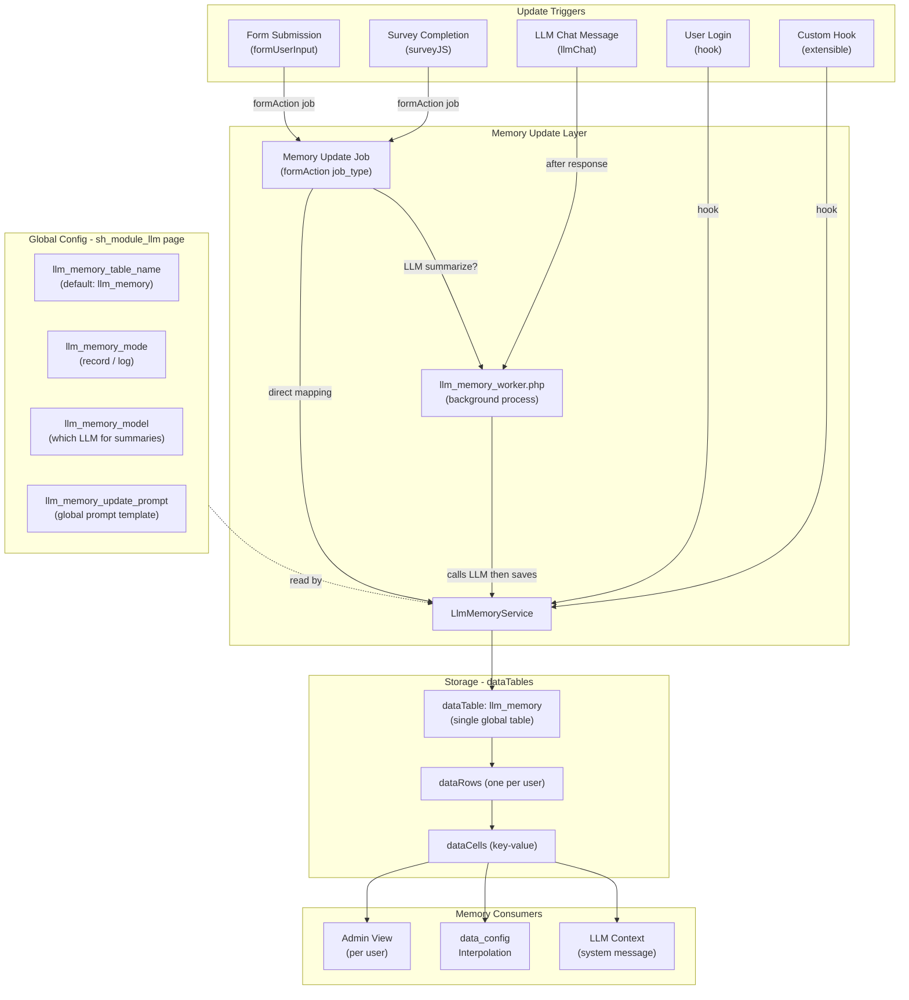

# LLM User Memory System

## Concept

The "memory" is a per-user dataTable record that accumulates structured key-value data about the user across their interactions. It serves as a **living user profile** that the LLM can access for personalized context, and that other components can read via `data_config` + `{{interpolation}}`.

## Architecture




## Two-Level Configuration

### Global Level: `sh_module_llm` page type (plugin-wide settings)

These fields are added to the existing LLM configuration page (`/admin/module_llm`), alongside `llm_base_url`, `llm_api_key`, etc. They are read by `BaseLlmService::getLlmConfig()` which already loads all `llm_*` fields from this page.

- `**llm_memory_table_name**` (text, default `llm_memory`): The single global dataTable name for user memory. All llmChat instances and all triggers write to this same table.
- `**llm_memory_mode**` (text, default `record`): `record` = one row per user (overwrite), `log` = append new row per update.
- `**llm_memory_model**` (select-llm-model): Which LLM model to use when generating memory summaries. Can differ from the chat model (e.g., a faster/cheaper model).
- `**llm_memory_update_prompt**` (llm_prompt): The global prompt template that instructs the LLM on how to summarize/extract data for memory updates. Used by both chat-triggered and form-action-triggered LLM summarizations.
- `**llm_memory_enabled**` (checkbox, default 0): Master switch to enable/disable the memory system globally.

### Per-Style Level: `llmChat` style fields

Each llmChat instance controls whether it participates in memory:

- `**enable_memory**` (checkbox): Load user memory into this chat's LLM context as a system message.
- `**enable_memory_update**` (checkbox): After each assistant response in this chat, trigger an async memory update.
- `**memory_update_prompt**` (llm_prompt, optional): Override the global `llm_memory_update_prompt` for this specific chat. If empty, falls back to global prompt.

No `memory_table_name` or `memory_mode` per style -- those are global. This ensures all chats write to the same memory.

## Storage Design

Uses SelfHelp's existing **dataTables/dataRows/dataCells** architecture:

- Per-user records via `dataRows.id_users`
- Flexible key-value columns via `dataCols`/`dataCells` (auto-created on first write)
- Full interpolation support (`{{field_name}}` from `data_config`)
- Admin visibility via existing dataTable views
- Audit trail via `transactions` table

### Single Global Table

Default table name: `llm_memory`. One table for the entire project. Multiple llmChat instances, form triggers, survey triggers, and login hooks all write to this same table.

### Record vs Log Mode

- **Record mode** (default): One row per user, continuously updated (overwrite). Best for current state: preferences, last activity, accumulated profile.
- **Log mode**: Append a new row per update. Best for tracking changes over time. Each memory snapshot is preserved.

## Core Service: `LlmMemoryService`

New file: [server/service/LlmMemoryService.php](server/service/LlmMemoryService.php)

Extends `BaseLlmService`. Reads global config via `$this->getLlmConfig()`.

```php
class LlmMemoryService extends BaseLlmService {
    // --- Sync operations (lightweight, no LLM call) ---
    public function updateMemory($user_id, $data);
    public function getMemory($user_id);
    public function clearMemory($user_id);
    public function getMemoryForContext($user_id); // formatted string for LLM system prompt

    // --- Async operation (spawns background process) ---
    public function updateMemoryWithLlmAsync($user_id, $input_data, $prompt_override = null);

    // --- Config helpers (from global getLlmConfig) ---
    public function getMemoryTableName();  // from llm_memory_table_name
    public function getMemoryMode();       // from llm_memory_mode
    public function isMemoryEnabled();     // from llm_memory_enabled
}
```

- `updateMemory()`: Direct key-value write via `UserInput::save_data()`. Used by form action direct-mapping, login hooks.
- `updateMemoryWithLlmAsync()`: Spawns `llm_memory_worker.php` in background. The worker loads current memory + input data, calls LLM with the memory prompt, parses structured output, saves to dataTable. Used by chat-triggered updates and form actions with `llm_summarize: true`.
- `getMemoryForContext()`: Loads the user's memory row and formats it as a readable string for injection into LLM system messages.

## Async Memory Worker

New file: [server/service/llm_memory_worker.php](server/service/llm_memory_worker.php)

Follows the exact pattern of existing [server/service/llm_async_worker.php](server/service/llm_async_worker.php):

1. CLI-only entry point
2. Reads args from temp JSON file (user_id, input_data, prompt_override, http_host)
3. Bootstraps SelfHelp services
4. Loads current user memory from dataTable
5. Calls LLM API with: current memory + new input data + memory update prompt
6. Parses structured JSON response (field names + values)
7. Saves updated memory via `LlmMemoryService::updateMemory()`
8. Logs transaction

The spawn mechanism reuses `LlmHooks::find_php_cli_binary()` and the `popen()` pattern from `execute_llm_script_async()`.

## Update Triggers

### 1. Form Action Job Type: `llm_memory_update`

Leverages existing `formActions` system. Admin configures on any form/survey.

Two sub-modes in the job config:

**Direct mapping** (no LLM call, synchronous):

```json
{
  "job_type": "llm_memory_update",
  "field_mapping": {
    "mood_score": "{{mood}}",
    "last_survey_date": "{{@now}}",
    "preferred_topics": "{{interests}}"
  }
}
```

Resolved fields are passed directly to `LlmMemoryService::updateMemory()`.

**LLM summarize** (async, spawns background worker):

```json
{
  "job_type": "llm_memory_update",
  "llm_summarize": true,
  "llm_summarize_prompt": "optional override prompt"
}
```

All form fields are passed to `LlmMemoryService::updateMemoryWithLlmAsync()`. The background worker calls the LLM to decide what to extract and save.

### 2. LLM Chat Integration (async, after each response)

When `enable_memory_update` is on for an llmChat instance:

- After `LlmChatController` processes an assistant response, it calls `LlmMemoryService::updateMemoryWithLlmAsync()`
- Input data = latest user message + assistant response + conversation summary
- The background worker processes the memory update without blocking the chat response
- The user sees no delay

### 3. Hook-Based Triggers (Login, Profile Update)

Lightweight synchronous hooks (no LLM call):

- `hook_on_function_execute` on `Login::login_user`: writes `last_login = now()` to memory
- `hook_on_function_execute` on relevant profile update methods: writes changed profile fields

These use `LlmMemoryService::updateMemory()` directly (fast, just a DB write).

### 4. LLM Script Integration

Existing `llm_script` jobs can target the memory table as their output table by setting `generated_id = llm_memory` in the script config. No new code needed.

## Memory in LLM Context

In [server/service/LlmContextService.php](server/service/LlmContextService.php), add a new step in `buildContextMessages()`:

```php
// After language context, before response schema
if ($this->model->isMemoryEnabled()) {
    $context_messages = $this->applyMemoryContext($context_messages);
}
```

The `applyMemoryContext()` method:

1. Loads user memory via `LlmMemoryService::getMemoryForContext()`
2. Formats as system message: `"USER MEMORY (persistent profile data about this user):\n{key: value, ...}\n\nUse this information to personalize responses."`
3. Inserts after language context but before other system messages

## Memory in Component Interpolation

Since memory is stored in standard dataTables, it works automatically with SelfHelp's existing `data_config`:

```json
{
  "table": "llm_memory",
  "retrieve": "last",
  "filter": "own"
}
```

Then in any component's text field: `Hello {{preferred_name}}, your last mood score was {{mood_score}}.`

No new code needed for this -- it's a native SelfHelp capability.

## Database Migration: `v1.2.0.sql`

New file: [server/db/v1.2.0.sql](server/db/v1.2.0.sql)

### 1. Plugin version bump

```sql
UPDATE plugins SET version = 'v1.2.0' WHERE name = 'llm';
```

### 2. New lookups

- `transactionBy` / `by_llm_memory` / `By LLM Memory`
- Job type enum value for `llm_memory_update`

### 3. Global config fields on `sh_module_llm` page type

```sql
INSERT IGNORE INTO fields (name, id_type, display) VALUES
('llm_memory_enabled', get_field_type_id('checkbox'), '0'),
('llm_memory_table_name', get_field_type_id('text'), '0'),
('llm_memory_mode', get_field_type_id('text'), '0'),
('llm_memory_model', get_field_type_id('select-llm-model'), '0'),
('llm_memory_update_prompt', get_field_type_id('llm_prompt'), '0');

-- Link to sh_module_llm page type with defaults
INSERT IGNORE INTO pageType_fields (...) VALUES
(..., 'llm_memory_enabled', '0', 'Master switch for user memory system'),
(..., 'llm_memory_table_name', 'llm_memory', 'Global dataTable name for user memory'),
(..., 'llm_memory_mode', 'record', 'record = one row per user (overwrite), log = append'),
(..., 'llm_memory_model', '', 'LLM model for memory summarization (empty = use default)'),
(..., 'llm_memory_update_prompt', '', 'Prompt template for LLM memory updates');
```

### 4. Per-style fields on `llmChat`

```sql
INSERT IGNORE INTO fields (name, id_type, display) VALUES
('enable_memory', get_field_type_id('checkbox'), '0'),
('enable_memory_update', get_field_type_id('checkbox'), '0'),
('memory_update_prompt', get_field_type_id('llm_prompt'), '0');

-- Link to llmChat style
INSERT IGNORE INTO styles_fields (...) VALUES
(..., 'enable_memory', '0', 'Load user memory into LLM context'),
(..., 'enable_memory_update', '0', 'Trigger async memory update after each response'),
(..., 'memory_update_prompt', '', 'Override global memory prompt for this chat (optional)');
```

### 5. Hook registrations

- Memory job execution hook (like `llm_script` pattern)
- Job schema extension hook
- Task config hook
- Job type hook
- Login hook (lightweight)

## Files to Create/Modify

### New Files

- `server/service/LlmMemoryService.php` -- Core memory CRUD + async spawn
- `server/service/llm_memory_worker.php` -- CLI background worker for LLM-based memory updates
- `server/db/v1.2.0.sql` -- Database migration

### Modified Files

- `server/service/globals.php` -- Add constants (`ACTION_JOB_TYPE_LLM_MEMORY_UPDATE`, `TRANSACTION_BY_LLM_MEMORY`)
- `server/component/LlmHooks.php` -- Add hooks: `execute_llm_memory_task` (async-aware), extend `get_json_schema`/`get_task_config`/`get_job_type`, login hook
- `server/service/LlmContextService.php` -- Add `applyMemoryContext()` method
- `server/component/style/llmChat/LlmChatModel.php` -- Add `isMemoryEnabled()`, `isMemoryUpdateEnabled()`, `getMemoryUpdatePrompt()` (reads global config via getLlmConfig for table/mode)
- `server/component/style/llmChat/LlmChatController.php` -- After message processing, spawn async memory update

## Usage Workflow (Admin Perspective)

1. **Global setup** (once): Go to `/admin/module_llm`, enable `llm_memory_enabled`, optionally configure table name, mode, model, and the global update prompt.
2. **Enable memory on llmChat**: In CMS, set `enable_memory = true` on any llmChat section. The user's memory is now injected into that chat's context.
3. **Enable auto-updates from chat**: Set `enable_memory_update = true` on the llmChat. After each response, a background worker updates memory -- user sees no delay.
4. **Configure memory updates from forms/surveys**: On any form's `formActions`, add action with `job_type = llm_memory_update`. Use direct field mapping (fast) or `llm_summarize: true` (async LLM call).
5. **Use memory in other components**: Reference `llm_memory` in any component's `data_config` for `{{interpolation}}`.

